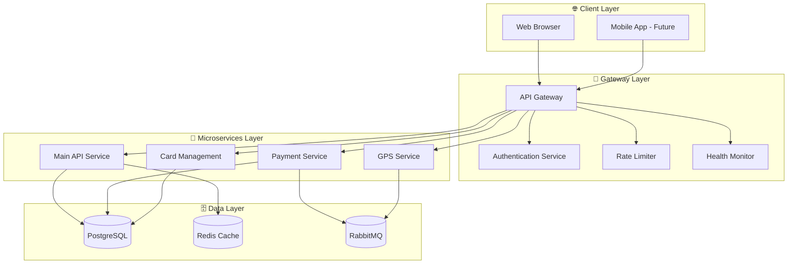
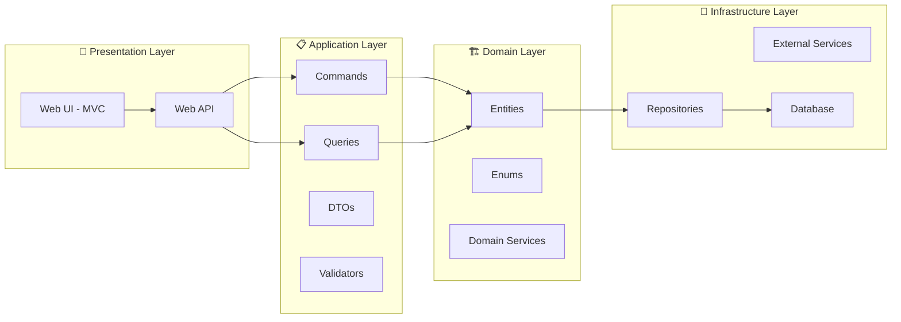
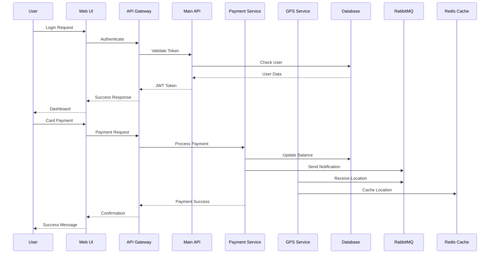
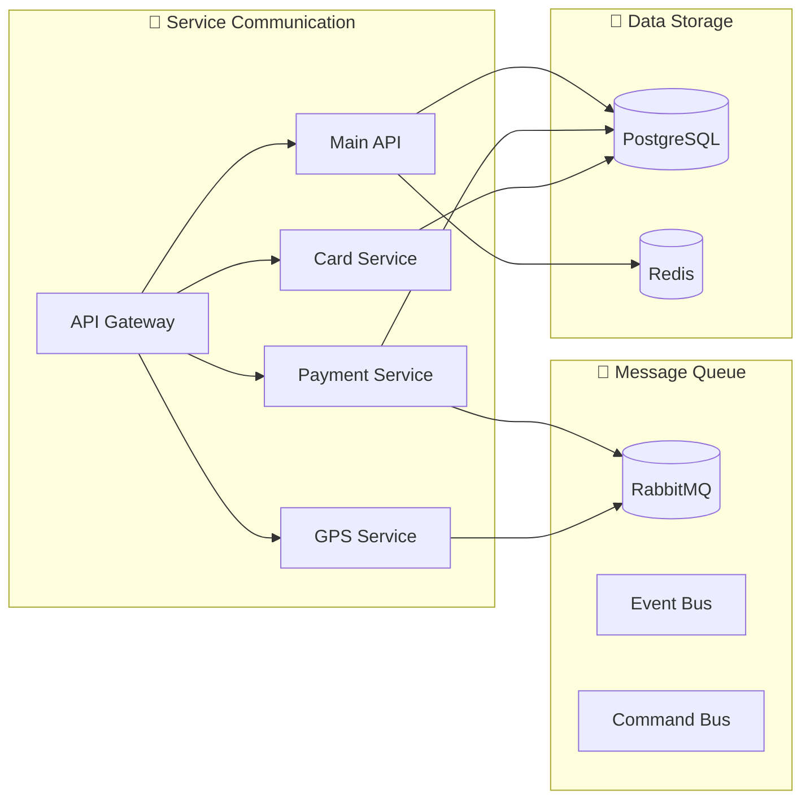
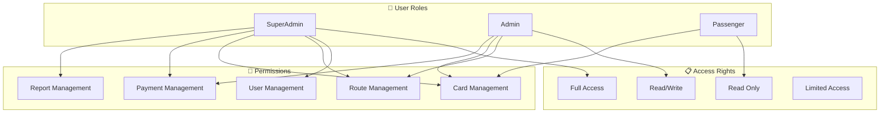
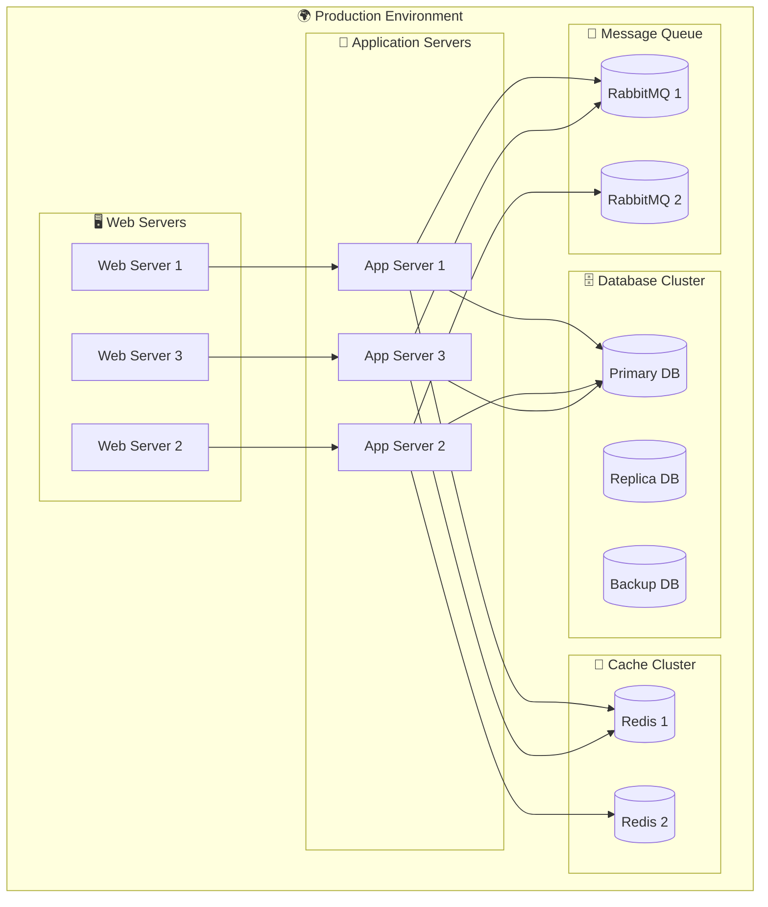
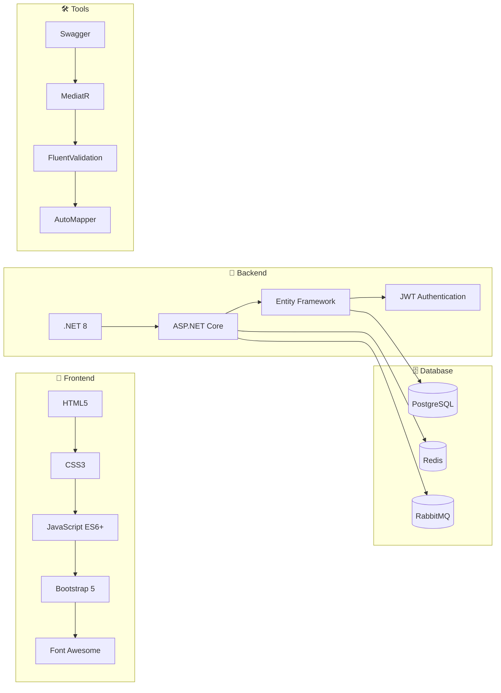

# 🏗️ Proje Mimari Şeması

## Sistem Genel Bakış

## Clean Architecture Katmanları

## Veri Akış Diyagramı

## Güvenlik Katmanları

```mermaid
graph TD
    subgraph "🔒 Security Layers"
        JWT[JWT Authentication]
        RBAC[Role-Based Access Control]
        APIKey[API Key Validation]
        RateLimit[Rate Limiting]
        Validation[Input Validation]
    end
    
    subgraph "🛡️ Data Protection"
        HTTPS[HTTPS Encryption]
        Hash[Password Hashing]
        SQLInjection[SQL Injection Protection]
        XSS[XSS Protection]
    end
    
    JWT --> RBAC
    RBAC --> APIKey
    APIKey --> RateLimit
    RateLimit --> Validation
    
    HTTPS --> Hash
    Hash --> SQLInjection
    SQLInjection --> XSS
```

## Mikroservis İletişimi

## Kullanıcı Rolleri ve İzinler

## Performans Optimizasyonu

```mermaid
graph TB
    subgraph "⚡ Performance Layers"
        CDN[CDN]
        LoadBalancer[Load Balancer]
        Cache[Redis Cache]
        Database[Database Indexing]
    end
    
    subgraph "📊 Monitoring"
        HealthCheck[Health Checks]
        Metrics[Metrics Collection]
        Logging[Logging]
        Alerting[Alerting]
    end
    
    subgraph "🔄 Optimization"
        ConnectionPool[Connection Pooling]
        QueryOptimization[Query Optimization]
        Caching[Application Caching]
        Compression[Response Compression]
    end
    
    CDN --> LoadBalancer
    LoadBalancer --> Cache
    Cache --> Database
    
    HealthCheck --> Metrics
    Metrics --> Logging
    Logging --> Alerting
    
    ConnectionPool --> QueryOptimization
    QueryOptimization --> Caching
    Caching --> Compression
```

## Deployment Mimarisi

## Teknoloji Stack Detayı

---

## 📊 Sistem Metrikleri

| Bileşen | Teknoloji | Versiyon | Amaç |
|---------|-----------|----------|------|
| **Frontend** | ASP.NET Core MVC | 8.0 | Kullanıcı arayüzü |
| **API Gateway** | ASP.NET Core | 8.0 | Merkezi yönetim |
| **Main API** | ASP.NET Core Web API | 8.0 | Ana iş mantığı |
| **Payment Service** | ASP.NET Core | 8.0 | Ödeme işlemleri |
| **GPS Service** | .NET Worker Service | 8.0 | Konum takibi |
| **Database** | PostgreSQL | 15+ | Ana veritabanı |
| **Cache** | Redis | 7.0+ | Önbellekleme |
| **Message Queue** | RabbitMQ | 3.12+ | Mesajlaşma |

---

*Bu mimari şeması, projenin teknik yapısını ve bileşenler arası ilişkileri görsel olarak sunmaktadır.*
