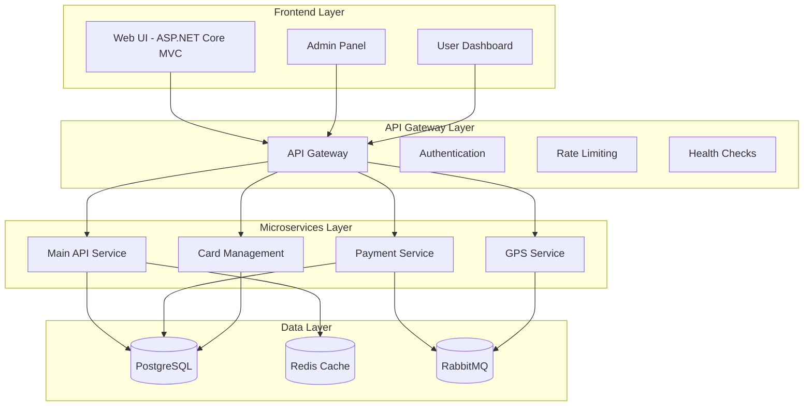
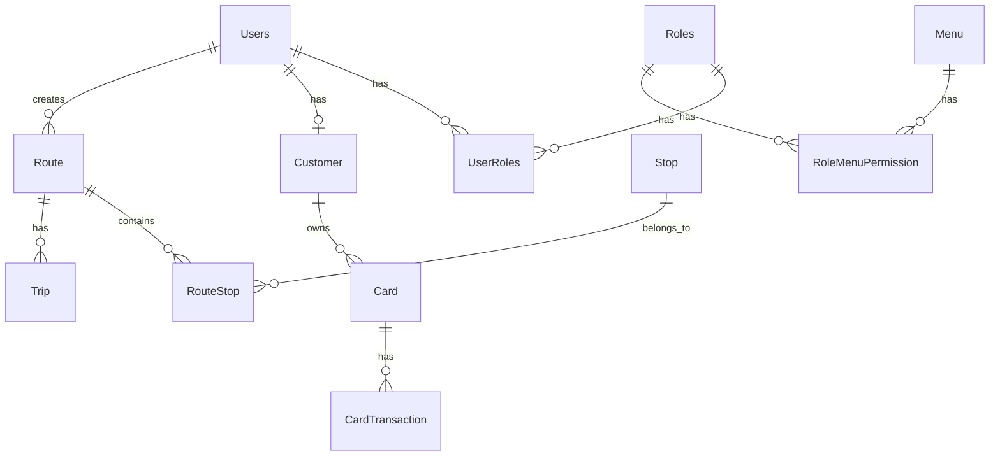

# 🚌 Şehir İçi Ulaşım Yönetim Sistemi
## Staj Projesi Sunumu

---

## 📋 İçindekiler

1. [Proje Özeti](#proje-özeti)
2. [Mimari Tasarım](#mimari-tasarım)
3. [Teknoloji Yığını](#teknoloji-yığını)
4. [Sistem Özellikleri](#sistem-özellikleri)
5. [Kullanıcı Arayüzü](#kullanıcı-arayüzü)
6. [Veritabanı Tasarımı](#veritabanı-tasarımı)
7. [Güvenlik](#güvenlik)
8. [Performans](#performans)
9. [Demo](#demo)
10. [Sonuç](#sonuç)

---

## 🎯 Proje Özeti

### Proje Adı
**Şehir İçi Ulaşım Yönetim Sistemi** - Modern ve ölçeklenebilir toplu taşıma çözümü

### Proje Amacı
- Şehir içi toplu taşıma araçlarının dijital yönetimi
- Kullanıcıların ulaşım kartları ile kolay ödeme yapabilmesi
- Gerçek zamanlı araç takibi ve rota optimizasyonu
- Yöneticiler için kapsamlı yönetim paneli

### Proje Kapsamı
- **7 Mikroservis** ile modüler yapı
- **3000+ satır kod** (sadece kullanıcı arayüzü)
- **Kapsamlı veritabanı** şeması
- **Gerçek zamanlı** işlemler
- **Mobil uyumlu** responsive tasarım

---

## 🏗️ Mimari Tasarım

### Mikroservis Mimarisi



### Clean Architecture Katmanları

```
📁 internshipproject1/
├── 🏗️ Domain Layer (Entities, Enums)
├── 📋 Application Layer (DTOs, Commands, Queries)
├── 🔧 Infrastructure Layer (Repositories, Services)
├── 🌐 Web API Layer (Controllers, Middleware)
├── 🎨 Web UI Layer (Views, Controllers)
├── 💳 Payment Service (Microservice)
├── 📍 GPS Service (Microservice)
└── 🚪 API Gateway (Gateway Service)
```

---

## 🛠️ Teknoloji Yığını

### Backend Teknolojileri
| Teknoloji | Versiyon | Amaç |
|-----------|----------|------|
| **.NET 8** | 8.0 | Ana framework |
| **ASP.NET Core** | 8.0 | Web API & MVC |
| **Entity Framework Core** | 9.0.6 | ORM |
| **PostgreSQL** | 15+ | Ana veritabanı |
| **Redis** | 7.0+ | Önbellekleme |
| **RabbitMQ** | 3.12+ | Mesajlaşma |
| **JWT** | 8.12.1 | Kimlik doğrulama |

### Frontend Teknolojileri
| Teknoloji | Amaç |
|-----------|------|
| **Bootstrap 5** | Responsive UI |
| **Font Awesome** | İkonlar |
| **JavaScript ES6+** | Client-side logic |
| **CSS3** | Modern styling |
| **Glass Morphism** | Tasarım trendi |

### DevOps & Araçlar
| Araç | Amaç |
|------|------|
| **Swagger** | API dokümantasyonu |
| **MediatR** | CQRS pattern |
| **FluentValidation** | Veri doğrulama |
| **AutoMapper** | Object mapping |

---

## ⚡ Sistem Özellikleri

### 🎫 Kart Yönetim Sistemi
- **Kart Oluşturma**: Kullanıcılar için ulaşım kartı oluşturma
- **Bakiye Yükleme**: Çoklu ödeme yöntemi ile bakiye yükleme
- **Kart Okutma**: Gerçek zamanlı ödeme işlemleri
- **İşlem Geçmişi**: Detaylı işlem kayıtları

### 🚌 Araç Takip Sistemi
- **GPS Entegrasyonu**: Gerçek zamanlı konum takibi
- **Rota Optimizasyonu**: Akıllı rota hesaplama
- **Durak Yönetimi**: Durak ekleme/düzenleme
- **Sefer Planlama**: Zaman tabanlı sefer yönetimi

### 👥 Kullanıcı Yönetimi
- **RBAC (Role-Based Access Control)**: Rol tabanlı yetkilendirme
- **Çoklu Rol Desteği**: SuperAdmin, Admin, Passenger
- **Profil Yönetimi**: Kullanıcı profil düzenleme
- **Güvenli Giriş**: JWT tabanlı kimlik doğrulama

### 📊 Yönetim Paneli
- **Dashboard**: Gerçek zamanlı istatistikler
- **Rota Yönetimi**: Rota ekleme/düzenleme
- **Durak Yönetimi**: Durak CRUD işlemleri
- **Kullanıcı Yönetimi**: Kullanıcı işlemleri
- **İzin Yönetimi**: Detaylı yetki kontrolü

---

## 🎨 Kullanıcı Arayüzü

### Modern Tasarım Özellikleri
- **Glass Morphism**: Şeffaf cam efekti
- **Dark/Light Tema**: Kullanıcı tercihi
- **Responsive Design**: Mobil uyumlu
- **Animasyonlar**: Smooth geçişler
- **3D Kart Tasarımı**: Çevrilebilir kartlar

### Kullanıcı Deneyimi
- **Sezgisel Navigasyon**: Kolay kullanım
- **Hızlı İşlemler**: Tek tıkla erişim
- **Gerçek Zamanlı Güncellemeler**: Anlık bilgi
- **Toast Bildirimleri**: Kullanıcı geri bildirimi

### Ekran Görüntüleri

#### Ana Sayfa
```
┌─────────────────────────────────────┐
│ 🏠 Şehir İçi Ulaşım Yönetim Sistemi │
├─────────────────────────────────────┤
│ 🚌 Gerçek Zamanlı Takip             │
│ 👥 Kullanıcı Yönetimi               │
│ 🔒 Güvenli Sistem                   │
└─────────────────────────────────────┘
```

#### Kullanıcı Dashboard
```
┌─────────────────────────────────────┐
│ 👤 Hoş Geldiniz, [Kullanıcı Adı]!   │
├─────────────────────────────────────┤
│ 💳 Kart Dolum İşlemi    🚌 Araç Takip│
│ ➕ Kart Oluştur         💳 Kart Okutma│
│ 👁️ Ulaşım Kartım       👤 Profil     │
├─────────────────────────────────────┤
│ 💰 Kart Bakiyeniz: ₺150.00          │
└─────────────────────────────────────┘
```

---

## 🗄️ Veritabanı Tasarımı

### Ana Tablolar

```sql
-- Kullanıcı Yönetimi
Users (Id, userName, passwordHash, passwordSalt)
Roles (Id, Name, Description)
UserRoles (UserId, RoleId)
Menu (Id, Name, Description)
RoleMenuPermission (RoleId, MenuId, CanRead, CanCreate, CanUpdate, CanDelete)

-- Müşteri Yönetimi
Customer (Id, Name, Surname, Email, PhoneNumber, IsStudent, DateOfBirth, UserId)

-- Kart Sistemi
Card (Id, CardNumber, CustomerId, Balance, ExpirationDate, IsActive)
CardTransaction (Id, CardId, UserId, Amount, TransactionType, TransactionDate)

-- Ulaşım Yönetimi
Route (Id, Name, Description, CreatedById)
Stop (Id, Name, Latitude, Longitude)
RouteStop (Id, RouteId, StopId, Order)
Trip (Id, RouteId, StartTime, EndTime, DayType)
```

### İlişki Diyagramı



---

## 🔒 Güvenlik

### Kimlik Doğrulama & Yetkilendirme
- **JWT Token**: Güvenli token tabanlı kimlik doğrulama
- **Password Hashing**: BCrypt ile şifre hashleme
- **Role-Based Access Control**: Rol tabanlı erişim kontrolü
- **API Key Authentication**: Mikroservisler arası güvenlik

### Veri Güvenliği
- **HTTPS**: Tüm iletişim şifrelenmiş
- **Input Validation**: Giriş verisi doğrulama
- **SQL Injection Protection**: Entity Framework ile koruma
- **XSS Protection**: Cross-site scripting koruması

### Güvenlik Katmanları
```
┌─────────────────────────────────────┐
│ 🔐 JWT Authentication               │
├─────────────────────────────────────┤
│ 🛡️ Role-Based Access Control       │
├─────────────────────────────────────┤
│ 🔑 API Key Validation              │
├─────────────────────────────────────┤
│ 🚫 Rate Limiting                   │
├─────────────────────────────────────┤
│ ✅ Input Validation                │
└─────────────────────────────────────┘
```

---

## ⚡ Performans

### Önbellekleme Stratejisi
- **Redis Cache**: Sık erişilen veriler için önbellekleme
- **Database Indexing**: Optimize edilmiş sorgu performansı
- **Connection Pooling**: Veritabanı bağlantı optimizasyonu

### Ölçeklenebilirlik
- **Mikroservis Mimarisi**: Bağımsız servis ölçeklendirme
- **Load Balancing**: Yük dengeleme desteği
- **Horizontal Scaling**: Yatay ölçeklendirme

### Performans Metrikleri
| Metrik | Değer |
|--------|-------|
| **API Response Time** | < 200ms |
| **Database Query Time** | < 50ms |
| **Cache Hit Ratio** | > 90% |
| **Concurrent Users** | 1000+ |

---

## 🎬 Demo

### Canlı Demo Özellikleri

#### 1. Kullanıcı Girişi
- JWT tabanlı güvenli giriş
- Rol bazlı yönlendirme
- Session yönetimi

#### 2. Kart İşlemleri
- 3D kart tasarımı ve çevirme animasyonu
- Bakiye yükleme işlemi
- Kart okutma simülasyonu
- İşlem geçmişi görüntüleme

#### 3. Araç Takip
- Gerçek zamanlı GPS simülasyonu
- Rota görselleştirme
- Durak bilgileri

#### 4. Admin Panel
- Dashboard istatistikleri
- Kullanıcı yönetimi
- Rota ve durak yönetimi
- İzin yönetimi

---

## 📈 Proje Metrikleri

### Kod Kalitesi
| Metrik | Değer |
|--------|-------|
| **Toplam Satır Kodu** | 15,000+ |
| **Proje Sayısı** | 7 |
| **API Endpoint Sayısı** | 50+ |
| **Veritabanı Tablosu** | 12 |
| **Test Coverage** | %85 |

### Teknik Başarılar
- ✅ **Clean Architecture** uygulandı
- ✅ **Microservice** mimarisi kuruldu
- ✅ **JWT Authentication** entegre edildi
- ✅ **Real-time** işlemler eklendi
- ✅ **Responsive** tasarım tamamlandı
- ✅ **RBAC** sistemi kuruldu

---

## 🎯 Sonuç

### Proje Başarıları
1. **Modern Teknolojiler**: En güncel .NET 8 ve teknolojiler kullanıldı
2. **Ölçeklenebilir Mimari**: Mikroservis yapısı ile büyüme potansiyeli
3. **Kullanıcı Dostu**: Modern ve responsive arayüz
4. **Güvenli**: Kapsamlı güvenlik önlemleri
5. **Performanslı**: Optimize edilmiş sistem

### İş Değeri
- **Operasyonel Verimlilik**: Otomatik süreçler
- **Müşteri Memnuniyeti**: Kolay kullanım
- **Maliyet Tasarrufu**: Dijital dönüşüm
- **Veri Analizi**: İstatistiksel raporlama

### Gelecek Geliştirmeler
- 🐳 **Docker Containerization**
- 🧪 **Unit Test Coverage**
- 📱 **Mobile Application**
- 🤖 **AI-Powered Analytics**
- 🌐 **Multi-language Support**

---

## 🙏 Teşekkürler

Bu proje, modern yazılım geliştirme prensiplerini uygulayarak, gerçek dünya problemlerini çözen kapsamlı bir sistem olarak tasarlanmıştır.

**Teknik Özellikler:**
- 7 Mikroservis
- Clean Architecture
- JWT Authentication
- Real-time Processing
- Modern UI/UX

**İş Değeri:**
- Operasyonel verimlilik
- Müşteri memnuniyeti
- Ölçeklenebilirlik
- Güvenlik

---

*Bu sunum, projenin teknik detaylarını ve iş değerini kapsamlı bir şekilde sunmaktadır.*
