# 🚍 Public Transportation Management System  
### Toplu Taşıma Yönetim Platformu

**A scalable, microservice-based public transportation management platform built with .NET 8.**  
**.NET 8 ile geliştirilmiş, ölçeklenebilir mikroservis mimarisine sahip toplu taşıma yönetim platformu.**

---

## 🏗️ Solution Overview / Çözüm Genel Bakış

```mermaid
graph TD
    AG(ApiGateway) --> API(Main API)
    AG --> PS(PaymentService)
    AG --> UI(WebUI)
    API --> INFRA(Infrastructure)
    API --> APP(Application)
    API --> DOMAIN(Domain)
    UI --> API
    PS --> API
```



- **ApiGateway**: Central entry point, authentication, routing.
- **internshipProject1**: Main API (routes, stops, trips, users, cards).
- **PaymentService**: Card top-up, payment, transaction microservice.
- **internshipProject1.WebUI**: Modern user/admin web interface (MVC).
- **Application/Domain/Infrastructure**: Clean architecture, CQRS, EF Core, Redis, etc.

---

## 🚀 Tech Stack

- **Backend:** .NET 8, Entity Framework Core, PostgreSQL, Redis (cache), RabbitMQ (optional)
- **Frontend:** ASP.NET Core MVC, Bootstrap, jQuery
- **API Docs:** Swagger/OpenAPI
- **Auth:** JWT Bearer
- **Containerization:** Docker (in progress)
- **CI/CD:** GitHub Actions (suggested)

---

## 🔥 Features / Özellikler

- **User Panel:** Card management, balance top-up, trip history, vehicle tracking, profile.
- **Admin Panel:** User, card, route, stop, trip management.
- **Geolocation:** Find nearby stops, distance calculation (Haversine).
- **Payment:** Card top-up, transaction history (microservice).
- **API Gateway:** Centralized routing, security, scalability.
- **Modern UI:** Responsive, mobile-friendly, Turkish/English support.

---

## ⚡ Quick Start

```bash
# 1. Clone the repository
git clone <repository-url>
cd internshipProject1

# 2. Configure databases in appsettings.json
# 3. Run migrations
dotnet ef database update --project internshipProject1

# 4. Start all services (in separate terminals)
dotnet run --project ApiGateway
dotnet run --project internshipProject1
dotnet run --project PaymentService
dotnet run --project internshipProject1.WebUI

# 5. Access:
# - API Gateway:      https://localhost:7009/
# - Swagger (API):    https://localhost:7009/swagger
# - Web UI:           https://localhost:7010/
```

---

## 🗺️ Main Endpoints (Sample)

| Method | Endpoint                  | Description (EN/TR)                |
|--------|---------------------------|------------------------------------|
| GET    | /api/routes               | List all routes / Tüm rotalar      |
| GET    | /api/stops/nearby         | Nearby stops / Yakın duraklar      |
| POST   | /api/user/register        | Register / Kayıt ol                |
| POST   | /api/user/login           | Login / Giriş yap                  |
| POST   | /api/card/recharge        | Card top-up / Kart bakiye yükle    |
| ...    | ...                       | ...                                |

---

## 🖥️ WebUI Screenshots

> Kullanıcı Paneli, Kart Yönetimi, Araç Takip, Admin Paneli gibi modern ve kullanıcı dostu arayüzler içerir.  
> _Ekran görüntüleri ekleyebilirsiniz._

---

## 🗄️ Database Schema (Simplified)

```
User (Id, UserName, PasswordHash, ...)
Card (Id, UserId, Balance, ...)
CardTransaction (Id, CardId, Amount, Type, Date, ...)
Route (Id, Name, Description)
Stop (Id, Name, Latitude, Longitude)
Trip (Id, RouteId, StartTime, EndTime, DayType)
RouteStop (Id, RouteId, StopId, Order)
```

---

## 🛠️ Configuration

- Update `appsettings.json` for connection strings, JWT keys, Redis, etc.
- Environment variables are supported for secrets.

---

## 📝 Development Status

- [x] Main API (CRUD, Auth, Geolocation)
- [x] WebUI (User/Admin)
- [x] PaymentService (Microservice)
- [ ] Docker Support (In Progress)
- [ ] Redis Caching (In Progress)
- [ ] CI/CD Pipeline (Suggested)

---

## 🤝 Contributing / Katkı

Pull requests are welcome!  
Her türlü katkıya açığız. Lütfen önce bir issue açın ve katkı rehberini okuyun.

---

## 📬 Contact / İletişim

- **Author:** [Adınız]  
- **E-mail:** [e-posta adresiniz]  
- **LinkedIn:** [LinkedIn profiliniz]

---

**Version:** 1.0.0  
**Status:** Development / Geliştirme Aşamasında...